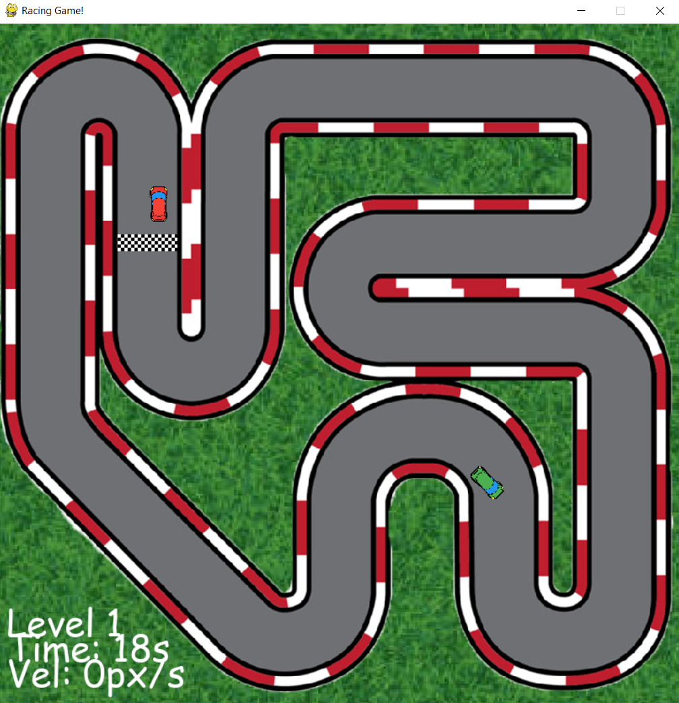

# 🏎️ Racing Game

A 2D top-down racing game built with Python and Pygame where players compete against a computer opponent on a challenging race track.


## 🎮 Game Features

- **Exciting Track Design**: Race on a custom-designed track with challenging turns and straightaways
- **Player vs Computer**: Compete against a computer opponent that follows an optimized racing path
- **Progressive Difficulty**: 10 levels of play with increasing difficulty
- **Physics-Based Movement**: Realistic car handling with acceleration, deceleration and rotation
- **Collision Detection**: Bounce off track borders and register finish line crossings
- **Real-time Stats**: Track your level, time, and velocity during gameplay

## 🕹️ Controls

- **W**: Accelerate forward
- **S**: Reverse
- **A**: Rotate left
- **D**: Rotate right

## 📋 Game Instructions

1. Start the game to enter Level 1
2. Navigate the track using the controls listed above
3. Cross the finish line before the computer car to advance to the next level
4. Complete all 10 levels to win the game
5. Avoid hitting the track borders which will slow you down
6. If the computer reaches the finish line first, you lose the level

## 🔧 Requirements

- Python 3.13
- Pygame

## 💻 Installation

1. Clone the repository:
```bash
git clone https://github.com/ZechariaTomer/car_race.git
cd racing-game
```

2. Install the required packages:
```bash
pip install pygame
```

3. Run the game:
```bash
python main.py
```

## 📁 Project Structure

```
racing-game/
├── main.py           # Main game file
├── utils.py          # Utility functions
├── imgs/             # Game images
│   ├── grass.jpg     # Background texture
│   ├── track.png     # Race track
│   ├── track-border.png  # Track collision border
│   ├── finish.png    # Finish line
│   ├── red-car.png   # Player car
│   └── green-car.png # Computer car
└── screenshots/      # Game screenshots
```

## 🎯 Game Logic

- The player car is controlled by keyboard inputs
- The computer car follows a predefined path using a points system
- Collision detection is handled through mask overlapping
- Each level increases the computer car's speed
- The game is won by completing all levels before the computer

## 🔄 Future Improvements

- Add sound effects and background music
- Implement multiple tracks
- Add customizable car options
- Include a time trial mode
- Create a multiplayer option

## 👨‍💻 Credits

Developed by Tomer Zecharia

## 📄 License

This project is licensed under the MIT License.
